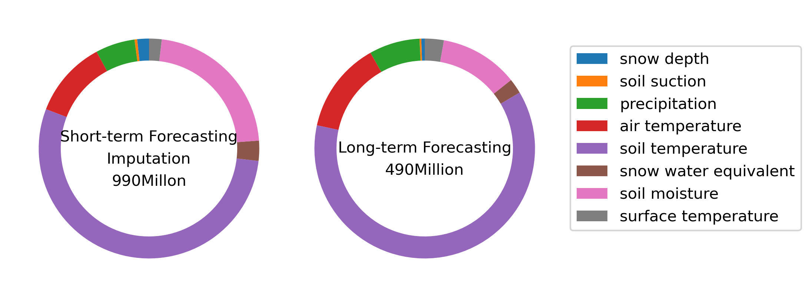
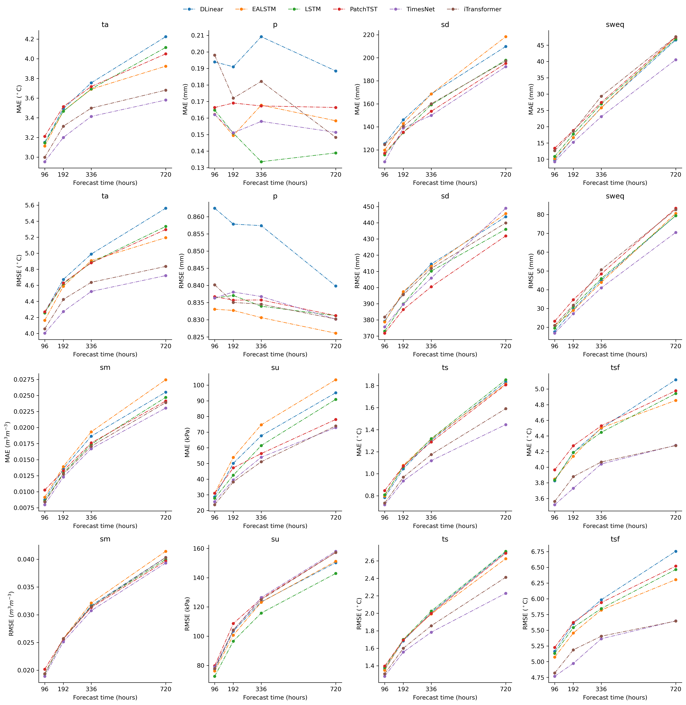
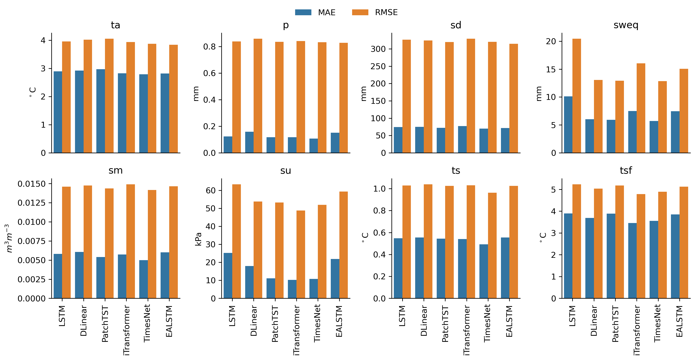
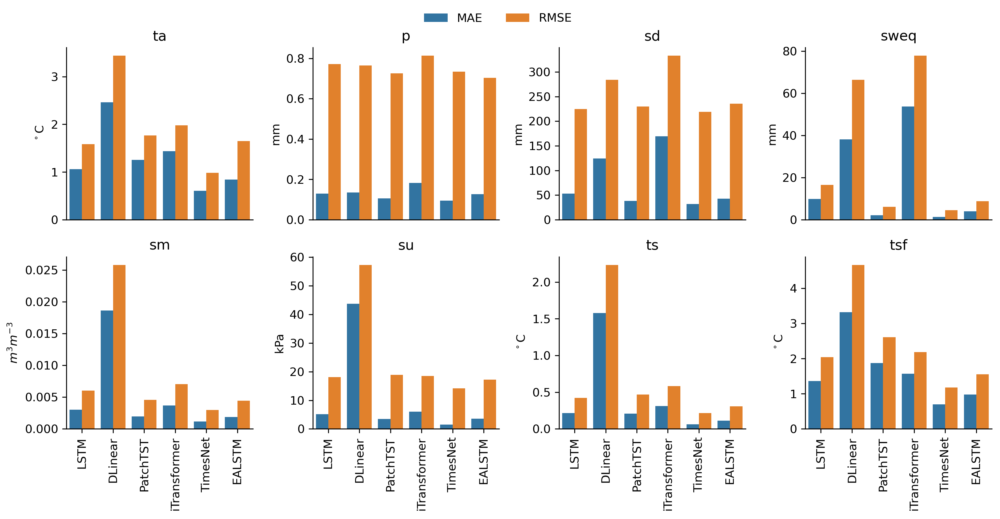
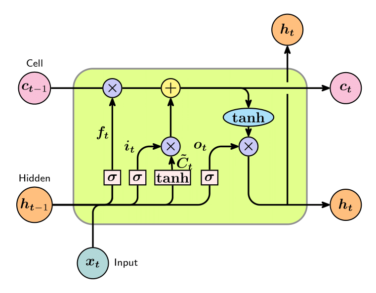
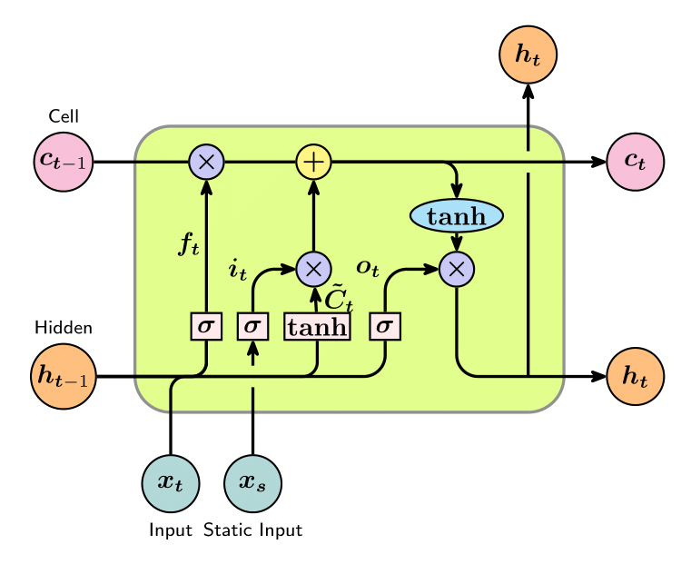
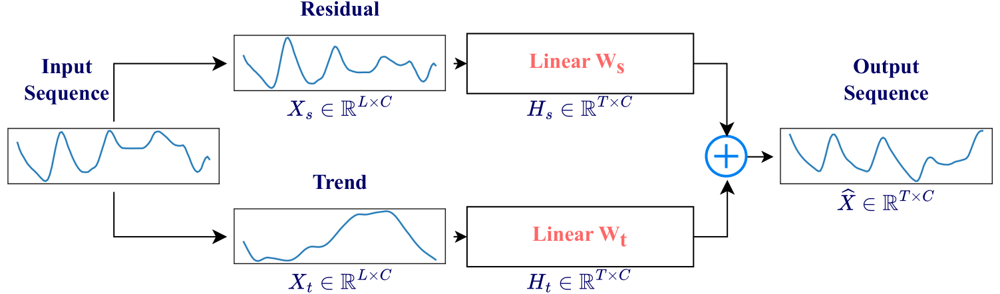
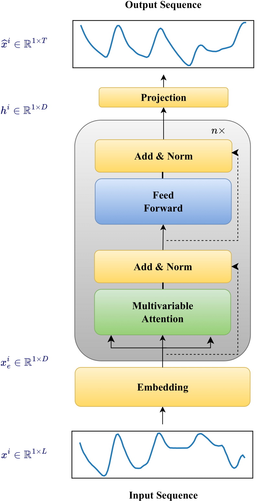
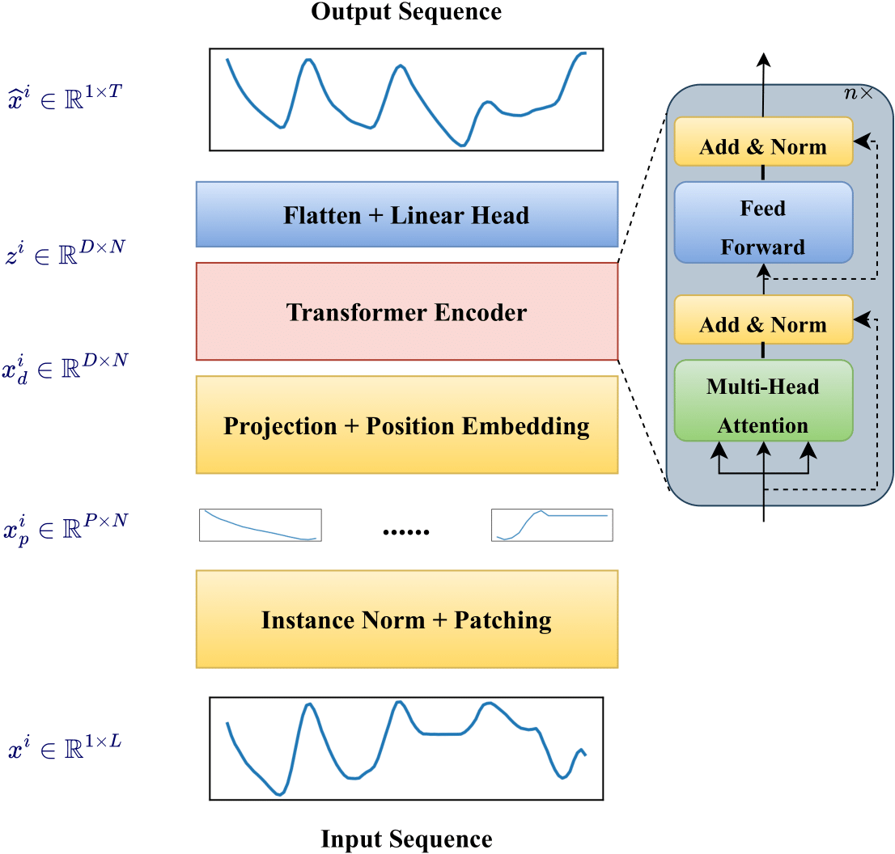
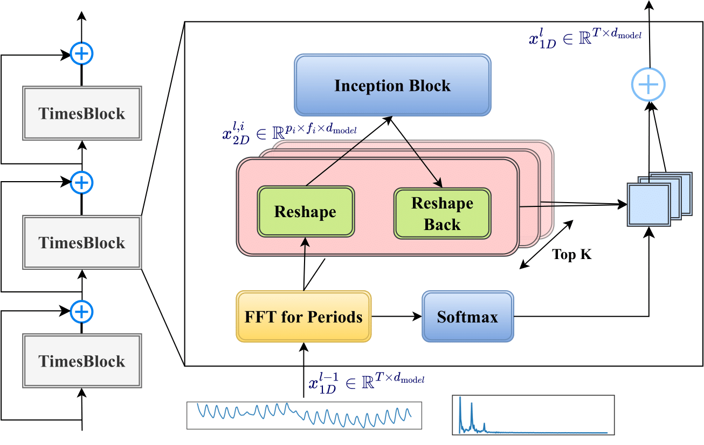

## Install

## Quick Start
  

## Data

## Results
### Long-term Forecasting

### Short-term Forecasting

### Imputation

## Models
### RNN-based
#### LSTM

#### EALSTM

### MLP-based
#### DLinear

### Transformer-based
#### iTransformer

#### PatchTST

### CNN-based
#### TimesNet
